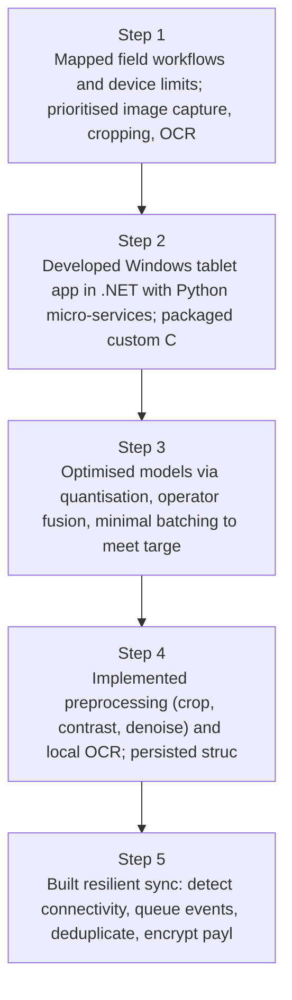
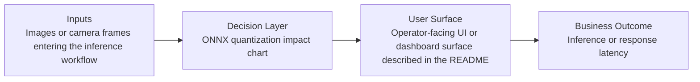
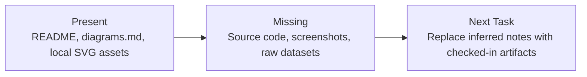

# Windows CPU-Only Offline AI App Diagrams

Generated on 2026-04-26T04:29:37Z from README narrative plus project blueprint requirements.

## Offline-first architecture (.NET + Python microservice)

## ONNX quantization impact chart

## Evidence Gap Map

